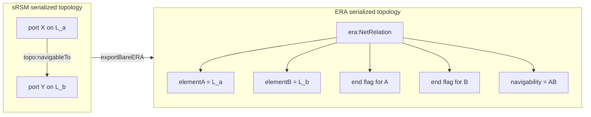
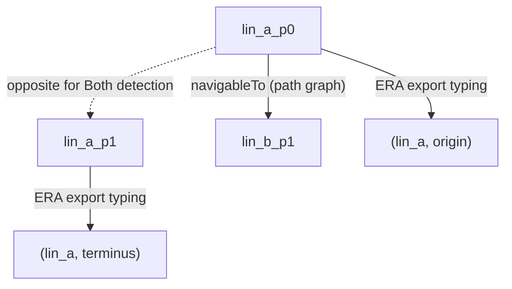
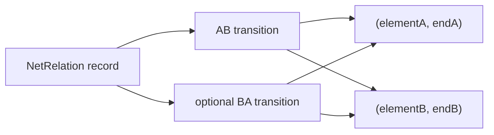
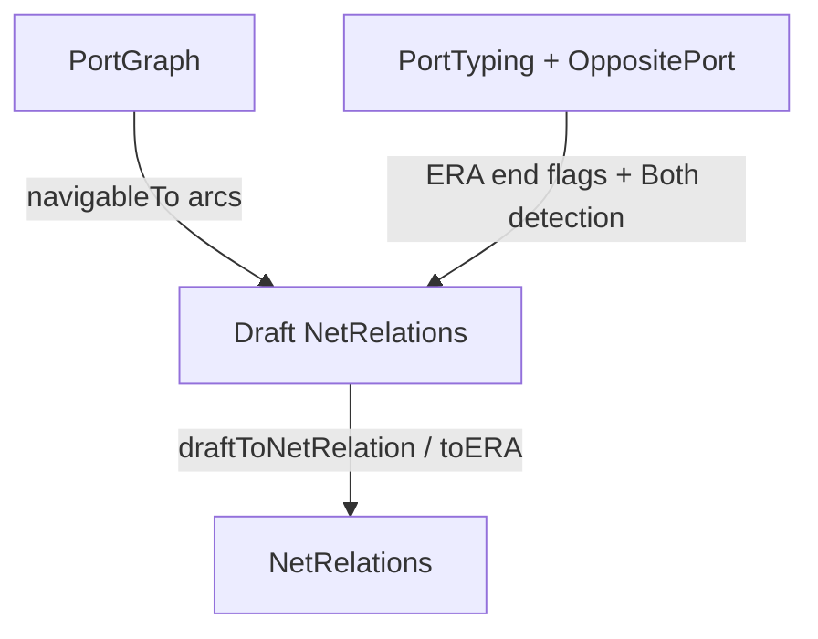
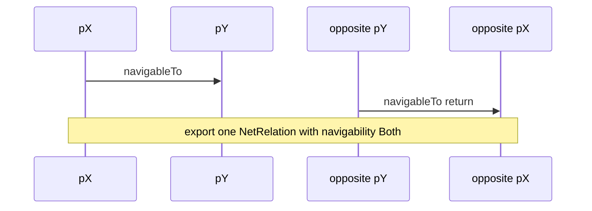
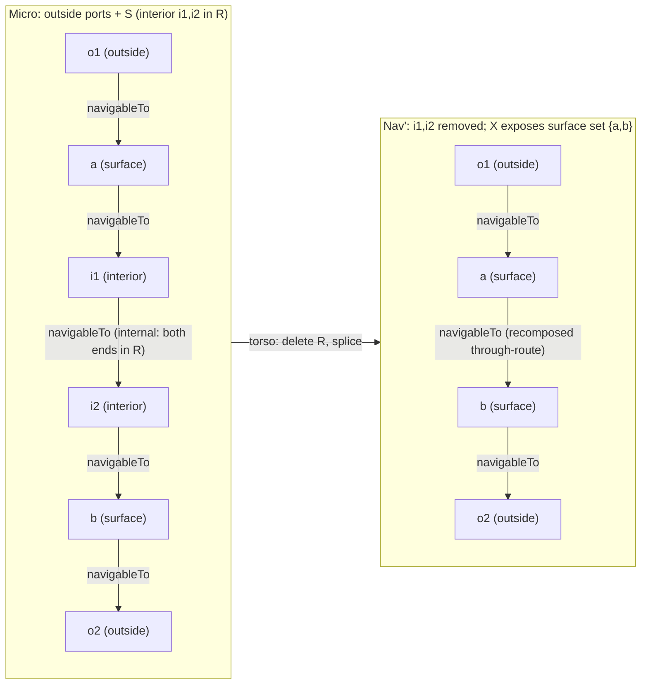

## Purpose

Lay down the principles of semantic RailSsystemModel (sRSM) topology.

RSM topology is quite general in itd application range, and allows to represent rail-specific features as well.

## Operating rolling stock on railway networks

One principle of railway operations is to avoid reversing the travel direction. More precisely, this avoidance is characteristic of train circulation, as opposed to shunting movements.

Such principle is not an "internalisation" of technical constraints: tracks are essentially bidirectional, signalling and train detection can be made bidirectional if money is no issue, trains can instantly reverse travel direction, except when the driver has to change cab.

>  Note: some rolling stock was even designed with a single cab and single driving desk, regardless of travel direction: the French X3800 railcar had such cab and could run in either direction, even with a coupled trailer.

**The problem with reversal is systemic**. Direction reversal, under most circumstances, consumes network capacity and increases travel time, resulting in significant extra capital and operational costs. This is why path search is generally under the constraint of "not reversing travel direction". Besides, path search allowing direction reversal is a trivial exercise, so the focus of the network topology representation is definitely "path search without reversing travel direction". Of course, when such path search fails, reversal becomes a necessary evil.

So the function to be represented and computed is "navigability" (a term coined by the SNCF ARIANE model, it seems), i.e. the ability to traverse a network without reversing travel direction. Of course, for a train actually traversing a route, other conditions must be fulfilled: points must be set and locked, signals must be open, the locomotive needs energy, the driver must do his job, etc. But navigability is understood as basic feasibility of a path as per network layout, which is a major constraint in a guided transportation system.

## Representing the topology of railway networks: Historical background

The trend initially set by the SNCF ARIANE model and its shared avatar, RTM (published by UIC as IRS 30100), was to represent the network as a graph of net elements (linear or non-linear) as "places" or "vertices", and navigability relations as "edges". Using such representation, every track section (a linear element at "micro" level of representation) has a matching node in the graph, and graph edges only represent the potential ability to move from one linear element to another, by means of track-changing devices such as switches, crossings, turntables, etc.

The fundaments of the ARIANE model topology are exposed in https://www.witpress.com/elibrary/wit-transactions-on-the-built-environment/114/21421 (2010).

This representation has since then been embraced by all versions of RTM (including the versions used by railML3 or INFRABEL), RSM (successor model of RTM), semantic RSM a.k.a. sRSM (the "semantic" version of RTM/RSM), and more recently the ERA ontology.

While sRSM underwent some significant re-engineering, the original RTM topology semantics were kept. Purpose of this chapter is to explain the evolutions and the underlying rationale. Differences with other topology representations (esp. ERA ontology that is also derived from RTM) are explained and their consequences checked.

## Fundamental topology choices

### RTM and ERA graph

The nodes of the infrastructure network graph are linear elements, generally understood as track segments (at "MICRO" level of detail). The graph edges are called "net relations" and . Disambiguation requires distinguishing the extremities of linear elements and identifying the travel direction concerned: all these parameters are borne by attributes of the edges, which need to be reified (implemented as objects) in order to carry this information. Reification is a consequence of current limitations of both UML and RDF/OWL.

> Note: in RDF and unlike UML, properties (providing edges of the RDF graph) are first class objects, as they can be defined irrespectively of nodes. However, as of today, they cannot themselves bear properties, except annotations.

Bottom line, the RTM or ERA navigability graph is a typed (or "colored") graph with two node types (linear element, navigability relation) and edges linking nodes of different types, under constraints expressed by the edge attributes:

<>

Using the RTM or ERA topology graphs, routes are composed of a succession of nodes of alternating types: (initial) linear element -> navigability relation -> linear element -> navigability relation -> ... -> (final) linear element. Composite routes **cannot** be computed using SPARQL property paths or OWL reasoners; a route of fixed length (= fixed number of hops) can be queried with explicit joins per hop, but unbounded path search requires preprocessing or code.

### RTO, an ontology proposal by Bischof and Schenner

In 2021, Bischof and Schenner (Siemens AG) analyzed the RTM model and proposed a transposition into OWL. The result is published under https://siemens.github.io/ProductConfigurationWithSHACL/topo/v1.0/ontology.ttl and documented under https://siemens.github.io/ProductConfigurationWithSHACL/topo/v1.0/index-en.html. As stated by the authors, "The ontology was built to be compatible with the UML model of RTM 1.1 to simplify the transition between RTM and RTO.

The authors clearly identified some shortcomings w.r.t. "reachability" (emphasis added):

> Answering reachability queries–i.e., determining which infrastructure elements are reachable by a train moving through the rail network–constitute an important application of the topology ontology. On the micro level of a railway topology, it is often necessary to compute reachability without changing direction. We call this directed reachability. **Directed reachability can only be defined for LinearElements**, because by traversing a NonLinearElement we lose the information about the orientation of the train on the element. Unfortunately, **writing a SPARQL query to obtain directly reachable LinearElements is non-trivial**, since we have to consider the different (local) orientations of the topology elements.

On the other hand, their conclusion was not to alter RTM, because

> ...it is unrealistic to expect that a newly created railway ontology without any relation to existing standards will be adopted by the community.

In the following, we show that:

* **directed reachability can be defined for nonlinear elements too;**
* **reachability queries can be made trivial;**
* **re-engineering does not mean giving up any of the fundamental RTM concepts.**

### sRSM graph

**The basic principle of sRSM topology is to consider the positional state of rolling stock movement**: "on element X, moving towards an extremity Xi") rather than its mere position ("on element X"). The actual position and speed of the rolling stock do not participate in the definition. The speed may even (temporarily) be zero, provided the direction of movement is not altered.

> Note 1: this definition requires the concept of rolling stock position with respect to net elements ("rolling stock is on element X") to be formally defined. *How* this location is defined is a separate concern and does not affect the concept of navigability. One possibility is to consider the position of the frontmost axle.
>
> Note 2: the time dimension does not appear explicitly here. The position of a moving train changes with time. In sRSM, time-related aspects are described by means of an upper ontology (DUL, a.k.a. DOLCE+DnS Ultralite). The practical representation of time-dependent train states is the main responsibility of the RSM Operations ontology that heavily relies on DUL.

This basic principle can be implemented in various ways. For instance, instead of having one linear element matching one track segment, we could have envisaged two oriented linear elements (one per travel direction) matching the same track segment: fine for path search, but heavy and confusing when it comes to describe fixed infrastructure assets.

We preferred to recognize "extremity of a linear element" as an intuitive and unambiguous concept that domain experts would think and speak about, making it a good candidate for a conceptual model entry, independently of the formal language adopted (UML or OWL).

sRSM keeps things simple (and well aligned with RTM and others) by enforcing two representational conventions:

***Convention #1***: the train state is merely represented by the extremity Xi, rather than the state variable (X, Xi). "On element X" is a property of extremity Xi, completing the state description. The state is never ambiguous thanks to convention #2.

***Convention #2***: an extremity belongs to a *single* net element. For instance, adjacent linear elements have *geometrically coinciding* extremities (but for geometric tolerances) but never share extremities. A loop shall also be considered a linear element with *two distinct, coinciding extremities*.

Therefore, the **nodes** (or vertices) of the navigability (or "reachability") graph have dual semantics:

- concretely, they are extremities of (linear) elements, called "ports", of class ```topo:Port``` . The "port" term is shorter and reflects a more general representation of networks where graph nodes are "hubs with ports" (see IFC, where such topology is used for piping systems).
This concrete meaning is relevant to infrastructure representation (maps or schemas).
- abstractly, they also represent the position (at net element granularity level) and movement direction of trains. 
This abstract meaning is relevant to train path search.

The two interpretations are always compatible (even in the case of nonlinear elements as defined later, a major change compared to earlier RSM and RTM versions. A semantically accurate representation could consist in defining two classes, "NetElementExtremity" and "TrainPositionState", and declare them equivalent (using ```owl:equivalentClass```), where each individual of one class is also an individual of the other class: the classes have different intensions but the same extension, in ontology parlance.

**Instead, we chose to define a single class** ```topo:Port```: this much pragmatism is hopefully acceptable, even in conceptual modelling, as it is explicit.

The sRSM navigability graph **edges** are links between adjacent train states, e.g. "If a train moves towards Xi (on X), it can then move towards Yj (on Y)". This relation between ports Xi and Yj can then be expressed as a directed edge from Xi to Yj.

<>

The network topology representation, for the purpose of train pathfinding, becomes a **simple directed graph** — a quiver with at most one arrow per ordered pair of vertices. It also has a simple mathematical equivalent (the **free category** $\mathrm{Free}(Q)$ on that quiver) with:

- objects = ports,
- generating arrows = navigableTo links,
- morphisms = finite directed `navigableTo` paths, the empty paths providing the identity morphisms, and
- unconstrained arrow composition (except for the basic composition rule "domain of next arrow = codomain of previous arrow").

As we will see, this topology formalisation, with focus on ports and their immediate relations, comes with significant computational advantages, especially in the context of the semantic web. 

## sRSM implementation of the topology graph

### Edges: navigableTo vs. navigableToTransitive

One immediate consequence of unconstrained arrow composition is that the OWL property "navigableTo", as defined in sRSM, is transitive. For technical reasons, we chose to reserve navigableTo to adjacent nodes (= the primary arrows) as a subproperty of navigableToTransitive, which is the transitive closure of navigableTo (= primary arrows plus composite arrows).

> Note: in OWL, subproperties do not "inherit" the characteristics of their super-properties. This is yet another example showing that "inheritance", a concept well-defined in Object-Oriented Programming and illustrated by UML class diagrams, is a **misleading term** and should **never** be used for ontology classifications. The rationale underpinning subproperties and their characteristics is as follows:
>
> - let A navigableTo B and B navigableTo C be directed links between neighbours

> Since navigableTo is a subproperty of navigableToTransitive, we can infer, by definition of "subproperty":
>
> - A navigableTo B => A navigableToTransitive B;
> - B navigableTo C => B navigableToTransitive C;

> Since navigableToTransitive has the characteristic 'transitive' (as the name suggests):
>
> - (A navigableToTransitive B) AND (B navigableToTransitive C) => A navigableToTransitive C

> The separation of elementary facts (navigableTo) and inferred facts (navigableToTransitive) is good practice from a data management point of view: see for instance the SKOS vocabulary that also makes such distinctions, introducing property pairs such as skos:broader and skos:broaderTransitive.

> Category-theoretical representation is simpler:
> The free category of ports with navigabilities is generated by immediate (next neighbour) navigableTo morphisms.
> Morphism composition applies.

### navigableTo property or Navigability class: user choice

The actual sRSM topology ontology implements navigableTo as an object property. It also provides the Navigability class (similar to original RTM and to ERA ontology). The benefit is to potentially add "properties of the property", such as a validity time interval, helping the management of topology transformations.

At any particular time, the relation between valid navigableTo property triples and valid Navigability individuals is bijective (a modelling discipline — one `Navigability` individual per port pair and validity interval — which OWL itself does not enforce).

Since the railway network topologies are quite stable in time, preference was given to the representation of navigabilities as object properties, easing graph traversal (no alternate port -> Navigability -> Port -> Navigability hops).

### non-navigability: asserting the negation

Navigabilities can be read out of track layouts as far as ordinary switches are concerned. Sprung switches (French: aiguillages talonnables non renversables, or 'TNR') and crossings (single-slip, double-slip) require more research and data collection.

Given the importance of network topology in many use cases (path finding, signalling...), it is essential to reflect the state of knowledge when building up the data graph. This is where the Open World Assumption underpinning OWL becomes relevant.

- Open World Assumption: if 'A navigableTo B' is not asserted and cannot be inferred, it is unknown (OWL style).
- Closed World Assumption: if 'A navigableTo B' is not asserted and cannot be inferred, it is false (RDBMS style).

Under the Open World Assumption, "not known to be true" is distinct from "known to be untrue". We therefore introduced the explicit negative property nonNavigableTo in order to document where it is not the case that port A is navigable to port B.

Non-navigability does not define a new concept. It does not participate in the path search (traversal of port graph using navigableTo). It allows to precisely document the *state of knowledge* about navigability.

> Note: This negative property is also provided by ARIANE, RTM, and ERA ontology. 

sRSM topology also defines further properties (e.g. `connectedWith`) for purposes that do not root in the concept "navigability". These purposes were considered separately ("separation of concerns" rule) and are out of scope here.

### Other useful topology properties

```topo:connectedWith```: a symmetric relation between "coinciding" ports. Required for schematic representation of a track layout when geometry information is not available. Instrumental in generating topology, and especially navigability properties, from other data sources such as OpenStreetMap or geographic surveys.

```topo:connectedWithTransitive```: the transitive closure of ```topo:connectedWith``` . Here again, we did not include in the ontology the fact that "connectedWith" is also reflexive, so all mutually connected ports actually form an equivalence class. These equivalence classes can then be mapped to "conventional" network graph representations where switches and buffers are nodes, and stretches of tracks between them are edges. This is another case where mathematical formalism is not completely reflected in the ontology for practical resaons (OWL profile violations).

sRSM comes with some "syntactic sugar". *(TODO: complete this section.)*

### Limitations

*(TODO: complete this section.)*

>  Note 2: all the above also applies to non-linear elements, which are net elements with a port count different from 2. This is where sRSM significantly expands the expressiveness of the original RTM. For reference, the original RTM had no "multiple ports" or attachment points on non-linear elements.

## From semantic RSM to ERA

In the following, we focus on the sRSM-to-ERA topology transformation and its implementation in code.


| Layer           | Serialized carrier                                            | Operational interpretation                                      |
| --------------- | ------------------------------------------------------------- | --------------------------------------------------------------- |
| **sRSM / work** | Ports plus oriented `topo:navigableTo` arcs                   | Direct graph of operational states for no-reversal pathfinding  |
| **ERA**         | Reified `era:NetRelation` individuals between linear elements | Repository from which oriented state transitions can be derived |


The transformation is therefore not a relabeling of graph nodes. It is a change of indexing:

- sRSM indexes navigability by **ports**. The path category is the port graph itself: ports as objects, `navigableTo` arcs as arrows.
- ERA stores a **relation record** over two linear elements, plus attributes saying which end of each element is involved and which direction(s) are allowed.
- A state graph can be reconstructed from ERA, but that graph is a computational view, not ERA's native topology representation.




## States as the computational interface

For route composition, a bare linear element identifier is not enough. A route step must know the element and the end involved:

$$\text{State} = (L, \varepsilon), \quad \varepsilon \in \text{origin}, \text{terminus}$$

In sRSM, this is carried by the port identity itself. In Haskell, `State { linearElement, atEnd }` in `TopologyState.hs` is the explicit form needed when translating ports into ERA endpoints, with `Origin` and `Terminus` corresponding to the two semantic ends of a linear element (`port0` and `port1` in the sRSM vocabulary).

This state notation is a **computational interface** for composition. It does not mean that the ERA file is itself a state graph, and it does not introduce any extra `navigableTo` relation between the two ports of a single linear element. The traversal of an element is part of the interpretation of a train state, not an additional internal navigability assertion.

The helper functions in `TopologyState.hs` should be read in that light:


| Symbol          | Meaning                                                                     |
| --------------- | --------------------------------------------------------------------------- |
| `sigma`         | The involution that swaps origin and terminus on the same linear element    |
| `sameJunction`  | Comparison predicate: two states refer to the same element end              |
| `passesThrough` | Comparison predicate: two states refer to opposite ends of the same element |


These are predicates on states used for reasoning and tests. They are not exported as topology arcs.

## sRSM as a port graph, plus export annotations

The sRSM navigability graph does **not** rely on vertex typing because all nodes are of the same type. For pathfinding, the graph is simply:

- objects: ports;
- arrows: `topo:navigableTo` arcs between ports.

That is the quiver/free category described above. The information called `PortTyping` in the Haskell code is not needed to compose sRSM paths. It is needed only when exporting to ERA, because ERA does not use ports as first-class path vertices and must instead store linear elements plus end flags.

The Haskell representation therefore keeps the path graph and the ERA-export annotations side by side (`SRSMGraph.hs`):


| Piece                | Haskell type    | Meaning                                                                                             |
| -------------------- | --------------- | --------------------------------------------------------------------------------------------------- |
| Path graph           | `PortGraph`     | Directed `navigableTo` arcs between ports; sufficient for sRSM path composition                     |
| ERA export typing    | `PortTyping le` | Map from each port to `(linear element, end)`, used to fill ERA `element`* and `isOnOrigin`* fields |
| ERA export opposites | `OppositePort`  | Map from `port0` to `port1` and back on the same element, used to detect ERA `Both`                 |





The important distinction is that `PortTyping` and `OppositePort` are not additional path structure. They are export annotations. `OppositePort` says which two ports belong to the two ends of the same linear element so the exporter can find the opposite-port return arc required by ERA `Both`. It is not an internal `navigableTo` edge.

## ERA as a reified relation repository

ERA stores topology as `NetRelation` individuals. In Haskell (`ERAGraph.hs`):

```haskell
data NetRelation le = NetRelation
  { elementA     :: le
  , elementB     :: le
  , onOriginA    :: Bool
  , onOriginB    :: Bool
  , navigability :: Navigability
  }
```

This mirrors the ERA data shape:

- `elementA`, `elementB`: the two related linear elements;
- `isOnOriginOfElementA`, `isOnOriginOfElementB`: which end of each element participates in the relation;
- `navigability`: `AB`, `BA`, `Both`, or `None`.

The Haskell module also defines `orientedTransitions`. This function derives one or two state transitions from a `NetRelation`:


| `navigability` | Derived transitions                    |
| -------------- | -------------------------------------- |
| `AB`           | `(elementA, endA) -> (elementB, endB)` |
| `BA`           | `(elementB, endB) -> (elementA, endA)` |
| `Both`         | both of the above                      |
| `None`         | no transition                          |


This derived transition relation is what path algorithms want. It is not the native ERA graph; it is an operational reading of the ERA repository.




`pathIsComposable` checks this derived view: consecutive relations compose only when the arrival state of one oriented transition is the departure state of the next. The Haskell code currently treats composition unambiguously only when each relation yields a single oriented transition; a `Both` relation must be oriented before a concrete path can be checked.

## Export pipeline

The Haskell export is intentionally close to the Python bare exporter:




At the Haskell level:

```haskell
exportBareERA opp typing portGraph =
  toERA (draftsFromSRSM opp typing portGraph)
```

This corresponds to the Python pipeline:

```text
exportBareERA ~= build_era_bare_topology_graph(drafts_from_srsm_graph(...))
```

### Auxiliary export map: port to ERA endpoint

The typing map tells the exporter which ERA endpoint a port denotes:

$$\tau : \text{Port} \to \text{State}, \quad \tau(p) = (L, \varepsilon)$$

Implemented as `portToState`. This is an export map, not a precondition for composing paths in the sRSM port graph.

### Arc map: one `navigableTo` to one AB draft

For one sRSM arc:

```text
pX topo:navigableTo pY
```

with:

```text
tau(pX) = (La, ea)
tau(pY) = (Lb, eb)
```

`draftFromArc` creates:

```text
Draft
  elementA     = La
  elementB     = Lb
  onOriginA    = (ea == Origin)
  onOriginB    = (eb == Origin)
  navigability = AB
```

The draft is then serialized as an ERA `NetRelation`.

### Both quotient: opposite-port return arc

The only place where the export is more than a direct arc map is the `Both` case. sRSM may encode bidirectional movement as a pair of opposite-port arcs:

```text
pX              navigableTo  pY
opposite(pY)    navigableTo  opposite(pX)
```

The second line is a return arc across the same connection, expressed through the opposite ends of the two involved linear elements. It is not an internal arc inside one linear element.

ERA represents this pair as a single `NetRelation` with `navigability = Both`. In Haskell:

- `hasReturnArc` detects the opposite-port return pattern;
- `draftsFromSRSM` upgrades the draft from `AB` to `Both`;
- both input arcs are marked consumed so the relation is not exported twice.




Categorically, the return-arc map $(p_X \to p_Y) \mapsto (\mathrm{opp}(p_Y) \to \mathrm{opp}(p_X))$ is an **involution** on the arc set (it is $\sigma$ acting contravariantly); an ERA `Both` relation records one **orbit** of this involution. The export thus identifies the two arcs of an orbit with a single bidirectional ERA relation record.

## What the Haskell code implements


| Concept                                       | Module          | Main symbols                                                       |
| --------------------------------------------- | --------------- | ------------------------------------------------------------------ |
| Derived states                                | `TopologyState` | `State`, `End`, `sigma`, `sameJunction`, `passesThrough`           |
| sRSM input + export annotations               | `SRSMGraph`     | `PortGraph`, `PortTyping`, `OppositePort`                          |
| ERA relation repository + derived transitions | `ERAGraph`      | `NetRelation`, `Navigability`, `StateGraph`, `orientedTransitions` |
| Export                                        | `Transform`     | `draftFromArc`, `hasReturnArc`, `draftsFromSRSM`, `exportBareERA`  |


The name `StateGraph` in `ERAGraph.hs` is a Haskell convenience wrapper around a list of `NetRelation`s plus functions that derive state transitions. It should not be read as a claim that the ERA serialization itself is a state graph.

## Relation to SPARQL / reasoning

The Haskell package does not run SPARQL. It materializes ERA `NetRelation`s.

If one wants to do reachability on ERA terms, a typical semantic-web pattern is:

1. read the `NetRelation` records;
2. derive directed state transitions `(element, end) -> (element, end)` from `navigability` and end flags;
3. query the derived transition graph, for instance with a transitive property such as `st:step+`.

This keeps the ERA file as a data repository while giving pathfinding algorithms the state graph they need.

## Aggregating net elements: nonlinear elements as surface views

The sRSM port graph supports MESO aggregation (in the sense of RTM, but realized in a different way). A set of MICRO-level net elements (linear elements) is replaced by a single **nonlinear element** that exposes only its **surface ports**. This section makes that operation precise and fixes the vocabulary. It expands the remark made later (see *"sRSM and ERA topology are not equivalent" → "Graph traversal"*) that aggregation "retains graph properties".

### The navigability structure as a preorder, not (only) a free category

The port graph admits two readings of the "Nav" structure introduced above (*"sRSM as a port graph"*):

- the **free category** $\mathrm{Free}(Q)$ on the quiver $Q = (\text{ports}, \texttt{navigableTo})$: morphisms are directed `navigableTo` *paths*, and two distinct paths $a \to b$ are distinct arrows;
- the **reachability preorder** $\mathrm{Nav} = (\text{Ports}, \le)$, the *preorder reflection* of $\mathrm{Free}(Q)$ (collapse each hom-set to at most one arrow; mutually reachable ports are **not** identified — a *posetal* reflection would conflate distinct ports on a cycle): $a \le b$ iff some `navigableTo` path $a \to b$ exists. Strictly, $\le$ is the **reflexive-transitive closure** of `navigableTo`: the empty path yields $a \le a$ for every port, whereas the OWL transitive property `topo:navigableToTransitive` yields $a \le a$ only on cycles; the difference is operationally harmless.

**Aggregation is an operation on the reachability preorder.** The decisive reason is invariance under interior subdivision: subdividing an arc $a \to b$ into $a \to p \to b$ (inserting an interior pass-through port $p$) must not change navigability. That holds in the preorder (reachability is unchanged) but **fails** in the free category, where path length (arrow count) and multiplicity are observable. So whenever we aggregate, "Nav" means the reachability preorder $=$ `navigableToTransitive` (up to the reflexive part noted above).

### Nonlinear element and the surface-port composition law

Let $S$ be a set of $N$ linear elements. Their endpoints form the port set $P_0$ ($|P_0| = 2N$; this count assumes every element of $S$ is linear — when re-aggregating a set that already contains a nonlinear element only this cardinality remark changes, the construction below is unaffected). The nonlinear element $X$ replacing $S$ exposes the **surface set** $P \subseteq P_0$:

$$P = \underbrace{ p \in P_0 : p \ \texttt{connectedWith}\ q,\ q \notin \text{ports}(S) }*{\text{boundary ports}}
\cup
\underbrace{ p \in P_0 : p \text{ has no } \texttt{connectedWith} }*{\text{dead ends (buffer stops)}}$$

where `connectedWith` is the symmetric physical-adjacency relation and a **dead end** is a port with **no `connectedWith` at all** (e.g. a buffer stop). Classification is purely connectivity-based: boundary ports are kept because they carry X's navigability across to the outside; dead ends are kept because an isolated terminus cannot be recovered by composition. The removed **interior** set is $R = P_0 \setminus P$ — ports `connectedWith` *only* other ports of $S$, i.e. internal junction ports (switch/crossing), which are removed regardless of their navigability pattern (a junction port may have outgoing but no incoming `navigableTo`, yet it is still interior).

**Deletion rule (precise).** Delete a port only if it is interior *and* non-terminal — i.e. it is only ever used strictly *between* two surface ports. This includes switch and crossing ports (branch vertices of degree $\ge 3$), not only degree-2 "pass-through" chains. Termini must be retained because composition cannot recover an endpoint: there is nothing to splice a source/sink into.

### The aggregated structure `Nav'`

Aggregation removes **only** the interior ports $R$; every other port of the network is retained. Hence the objects of `Nav'` are

$$\mathrm{Obj}(\mathrm{Nav}') = \mathrm{Obj}(\mathrm{Nav}) \setminus R = (\text{ports outside } S) \cup P,$$

i.e. **all ports except X's interior**, with the surface set $P$ acting as X's interface to the rest of the network.

**Definition (asserted arcs of `Nav'`).** Keep verbatim every `navigableTo` arc not touching $R$; in addition, assert $a \to b$ for surviving ports $a, b$ whenever there is a micro path

$$a \to r_1 \to \dots \to r_k \to b, \qquad r_i \in R \ (k \ge 1),$$

i.e. a recomposed arc whose witnessing path uses only interior intermediates.

**Proposition.** The reachability preorder $\le'$ generated by these asserted arcs is exactly the **restriction of the reachability preorder to the surviving ports**:

$${\le'} = {\le}\big|_{(\mathrm{Obj}(\mathrm{Nav})\setminus R)^2}.$$

*Proof sketch.* Any micro path between surviving ports factors through its surviving waypoints; each maximal interior run is one recomposed arc, so the whole path is a composition of asserted arcs. Conversely, every asserted arc witnesses a micro reachability. ∎

So among surviving ports **nothing is added and nothing is removed**; recomposition through interior ports is just transitivity. At a switch port, recomposition reproduces precisely the admissible through-routes that the switch's interior navigabilities permit.

> **Where the navigability lives.** A surface port is, in general, *not* `navigableTo` another surface port of the same X: its navigability is typically **to a port outside S, or from a port outside S**. One cannot even determine a surface port's navigabilities without knowing what lies outside S. The surviving navigabilities incident to X are therefore mostly **boundary-crossing** arcs (surface↔outside); a genuine through-route across X yields a recomposed surface→surface arc, but that is the exception.
>
> **Internal navigability** denotes a `navigableTo` arc with **both** endpoints in R. These have **no representative** in `Nav'`: they are consumed only as intermediate steps when splicing boundary-crossing arcs, and any fully interior chain or cycle that never reaches a surviving port is dropped entirely.

Object count:  |\mathrm{Obj}(\mathrm{Nav}')| = |\mathrm{Obj}(\mathrm{Nav})| - |R| = |\mathrm{Obj}(\mathrm{Nav})| - (|P_0| - |P|) . Surviving ports keep their identities; the surface ports' `onElement` typing changes from a linear element to X.




The boundary-crossing arcs `o1 → a` and `b → o2` are kept verbatim; the internal arc `i1 → i2` is lost; the through-route `a → b` is recomposed.

### Categorical status

- `Nav'` is the **full sub-preorder (full subcategory) spanned by the surviving ports** $\mathrm{Obj}(\mathrm{Nav})\setminus R$, and the inclusion $\iota : \mathrm{Nav}' \hookrightarrow \mathrm{Nav}$ is **fully faithful**:

$$\mathrm{Hom}*{\mathrm{Nav}'}(a,b) = \mathrm{Hom}*{\mathrm{Nav}}(a,b) \quad \forall a,b \in \mathrm{Obj}(\mathrm{Nav})\setminus R.$$

For a full subcategory this is automatic *given* the proposition above (that `Nav'` carries the restricted preorder); the substantive content is the proposition itself. Full faithfulness is the exact sense of "no dumbing down": aggregation neither invents nor loses navigability among surviving ports — in particular it preserves every boundary-crossing arc incident to a surface port.

- The **forward** operation $T : (\text{micro network}) \mapsto \mathrm{Nav}'$ is **forgetful and many-to-one**. Infinitely many interiors (different switch/crossing layouts, or arbitrarily many subdivisions) induce the same surviving preorder, so the fiber of $T$ is infinite. Hence $T$ has **no inverse and no canonical section** (set-theoretic sections exist by choice, but none is natural), and there is **no canonical forward functor** $\mathrm{Nav} \to \mathrm{Nav}'$: the inclusion $\iota$ admits, in general, no coreflector (an interior port reaching several surface ports has no universal approximation among the survivors). Note that $T$ acts on micro networks, not on `Nav` itself, so it is in particular not an endofunctor of `Nav`. Morphisms with an endpoint in $R$ are **deliberately forgotten** (their endpoint object is gone); the **internal navigabilities** — both endpoints in $R$ — have no representative at all, while one-endpoint-in-$R$ arcs survive only implicitly, spliced into the boundary-crossing arcs between surviving ports.

> The fully faithful inclusion and the lossy forward operation are *different statements about different things*: the inclusion compares one network with its own surface (and loses nothing there); the forgetting compares many networks that share a surface (and cannot be undone).

### Two levels: quotient on elements, restriction on ports

- On **net elements**, merging the $N$ linear elements of $S$ into one nonlinear element $X$ is a **quotient** (a surjection collapsing $S$ to a point).
- On the **navigability preorder**, the same act is a **restriction** to the full sub-preorder on the surviving ports $\mathrm{Obj}(\mathrm{Nav})\setminus R$ (a *subobject*), via the fully faithful inclusion above — not a quotient.

Use "aggregation / quotient" language at the element level; at the port/navigability level the operation is a **restriction**.

### Vocabulary (settled)


| Aspect                         | Name                                                                                                                       | Note                                                                                                                                                      |
| ------------------------------ | -------------------------------------------------------------------------------------------------------------------------- | --------------------------------------------------------------------------------------------------------------------------------------------------------- |
| Micro structure                | reachability preorder = preorder reflection of $\mathrm{Free}(Q)$ ≈ `navigableToTransitive` (reflexive-transitive closure) | objects = ports                                                                                                                                           |
| Surface set                    | surface ports $P$ = boundary ports ∪ dead ends                                                                             | X's interface; dead end = port with no `connectedWith` (connectivity-based)                                                                               |
| Removed set                    | interior ports $R = P_0 \setminus P$                                                                                       | any degree, incl. switches/crossings                                                                                                                      |
| Surviving ports                | $\mathrm{Obj}(\mathrm{Nav})\setminus R$ = (ports outside $S$) ∪ $P$                                                        | the objects of `Nav'`                                                                                                                                     |
| Internal navigability          | `navigableTo` with **both** endpoints in $R$                                                                               | no representative in `Nav'` (lost)                                                                                                                        |
| Boundary-crossing navigability | `navigableTo` incident to a surface port (surface↔outside)                                                                 | the navigability `Nav'` actually carries; preserved                                                                                                       |
| Graph-theoretic operation      | **torso / interface contraction** on the surviving ports (restricted transitive closure)                                   | term borrowed by analogy from tree-decomposition torsos; *not* smoothing/series reduction (too narrow); *not* a strict minor; *not* a port-level quotient |
| Order/category operation       | **restriction to the full sub-preorder (full subcategory) spanned by the surviving ports**                                 | inclusion $\iota : \mathrm{Nav}' \hookrightarrow \mathrm{Nav}$ is fully faithful                                                                          |
| Forward map                    | **forgetful, many-to-one, non-invertible**                                                                                 | no canonical section; no coreflector in general                                                                                                           |
| Element level                  | **quotient** (merge $S \to X$)                                                                                             | dual viewpoint                                                                                                                                            |
| Operational name               | **MESO/MACRO aggregation**                                                                                                 |                                                                                                                                                           |


### Properties relevant to implementation

- **Correctness criterion.** For surviving ports $a, b$, emit `a navigableTo b` iff $b$ is reachable from $a$ in the micro graph using only interior ($R$) intermediates — the restricted transitive closure (the torso). Arcs not touching $R$ are kept verbatim; arcs with one endpoint in $R$ are spliced; internal arcs (both endpoints in $R$) survive only as intermediate splice steps.
- **Operate on the whole network, not on S alone.** A surface port's navigabilities are generally to/from ports **outside S** and cannot be determined without that outside context, so the transform runs on the full work graph (with $S$ replaced by $X$); exporting $X$ in isolation would dangle the boundary-crossing arcs.
- **Conservative on surviving ports.** ${\le}\big|_{(\mathrm{Obj}(\mathrm{Nav})\setminus R)^2}$ is preserved exactly, so the MESO/MACRO graph can be used for pathfinding without descending to micro — unlike ERA, where composability is lost (see the next section).
- **Idempotent on views.** Aggregating an already-aggregated $X$ changes nothing; nested aggregations compose as inclusions $\mathrm{Nav}'' \hookrightarrow \mathrm{Nav}' \hookrightarrow \mathrm{Nav}$.
- **Lossy on the interior, by design.** $S$ cannot be reconstructed from $X$; do not expect it.
- **Keep dead ends.** Ports with no `connectedWith` (buffer stops) must be exposed as surface ports, or reachable endpoints are lost (they cannot be recomposed). Internal junction ports (which *do* have `connectedWith` to other ports of $S$) are removed even when their navigability is one-directional.

## Information: sRSM and ERA topology are not equivalent

### Graph traversal

So far we discussed the transformation from sRSM topology to ERA topology. The code allows a unique ERA topology graph to be derived deterministically from any given sRSM topology graph. Nevertheless, the ERA topology remains a data storage schema, and determination of paths remains a complex process, be it in SPARQL or in code.

If linear elements are aggregated to MESO or MACRO level, sRSM navigability graph serialisation changes but retains its properties (arrows can be composed and the composition is associative). In the case of the ERA topology, composability is lost and inferences can only be made by returning to the underlying MICRO level.

### Missing information vs. negative information

In both ERA and sRSM cases, traversing the navigability graph entirely depends on "positive" information, where navigability is affirmed.

Data management requires a difference to be made between false and unknown, as in "navigability of this relation is unknown" vs. "this relation is not navigable". This is where non-navigability properties play a role - not for path finding, but for checks of data completeness.

Both ERA and sRSM ontologies use negative statements to express that "there is no navigability", which is different from "navigability is unknown". Under the Open World Assumption generally applicable to ontologies, negation as failure does not apply: failing to prove navigability (either by query of RDF data *or by inference*) does not disprove navigability.

Here, sRSM and ERA topology ontologies are similar:


| Topology type | Not navigable case                                             | Unknown navigability case       |
| ------------- | -------------------------------------------------------------- | ------------------------------- |
| sRSM          | triple using property topo:nonNavigableTo (*always*)           | no navigableTo axiom (*always*) |
| ERA           | NetRelation with Navigability property 'None' (*general case*) | no NetRelation (*general case*) |


However in the ERA case, navigability values 'AB' and 'BA' are ambiguous : they may express that navigability is known to hold in the stated direction but unknown in the other direction, or not true in the other direction. In practice, such ambiguities will not arise often, as navigabilities 'AB' and 'BA' apply to sprung switches which are used infrequently. ERA topology could lift the ambiguity by extending the SKOS concept scheme, if so desired, e.g. 'AB' would mean 'AB and not BA', while 'AB?' would mean 'AB and maybe BA'.

